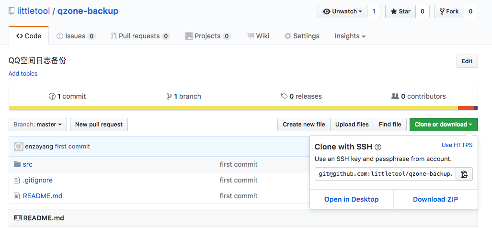
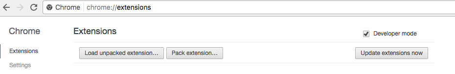

# QQ空间封印助手直接安装方法

1. 去到 [Github 代码库](https://github.com/littletool/qzone-backup) 从 「clone or download」 那里「Download ZIP」
	
	
2. 解压得到 qzone-backup-master 文件夹，进入这个文件夹。
3. 用 chrome 在新的 Tab 打开 [chrome://extensions/](chrome://extensions/) 
4. 勾上 「Developer mode」。
	
	
5. 把刚才打开的文件夹里的 src 文件夹拖到 chrome。
6. done.