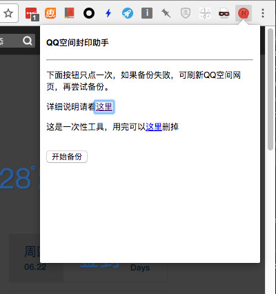
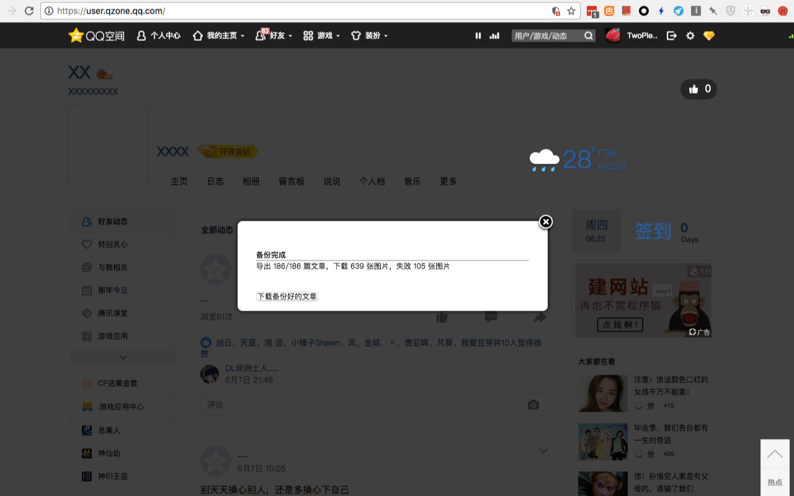

# QQ空间封印助手

## 安装

可以科学上网的同学可到 [Chrome Web Store](https://chrome.google.com/webstore/detail/qq%E7%A9%BA%E9%97%B4%E5%B0%81%E5%8D%B0%E5%8A%A9%E6%89%8B/cpablhkjijifpkdnffelmmoakmjedffm) 下载。

无法科学上网的同学可根据 [这篇](http://i.littletool.io/install_qzone_backup.html) 说明来安装。

## 简介


一个可以将自己QQ空间日志备份下来的 Chrome 插件。

每个互联网产品都有一个生命周期，或者你只会一段时间使用它。QQ空间的第一批用户已经越来越少使用QQ空间，假如有一天QQ号被盗，丢失找不回来，不想用了，那曾经写过的文字，拍过的照片就会留在网络上没人能看到的角落。

假如你觉得过去的尴尬文章还是需要Copy多一份，防止丢失，这个 Chrome 插件可以帮到你。

<br/>

它可以把QQ空间的日志打包保存成一个压缩文件，解压后有如下目录结构

```
qzone-xxxxx (xxx 是QQ号）
|--- 说明.txt
└--- blog (日志)
    └--- image (图片)
        |--- 2007-01-01_00-00_xxxx-xxx-xx-xx (这是图片，可能是jpg，png，gif或webp格式）
        |--- 2007-01-01_00-01_xxxx-xxx-xx-xx
        └---- ....
    |--- 2007-01-01_00-00-日志标题1.md (这是日志正文和评论，markdown格式，记事本也可以打开）
    |--- 2007-01-01_00-01-日志标题2.md 
    |--- ... 
    └--- 2007-01-01_00-0n-日志标题n.md
```

日志的内容类似这样，需要markdown编辑器才能看到图片。

```
# 标题
2007-01-01 12:00

正文正文正文
正文正文正文

还是正文还是正文

评论：
* 小A：Interesting
	* 阿久：好嘢
	* 小肥：哦啊哟
* X：[挖鼻屎]
* ... ...


```

## 预先说明

使用过程中遇到错误，先看本文后面的「已知问题」。

## .md 文件打开程序推荐

**Windows 推荐使用 [MarkdownPad](http://markdownpad.com/)， MacOS 推荐使用 [MacDown](http://macdown.uranusjr.com/)。**


## 使用说明

1. 安装好这个插件后，打开 qzone.com，登录后，那个有「封」字的图标就会亮起来。

	

2. 点击含「封」字的图标，再点「开始备份」，页面就会弹出提示正在备份，如果有很多日志和图片，可以先去泡杯茶。

	
	
3. 备份过程中可能会出现错误，但最终如果一切还算正常，在提示备份完成的同时会在弹框的底部出现一个下载按钮，点击下载即可得到日志的备份

	
	
4. 解压得到的备份，看看是否正常。

## 已知问题

* 只能在 Chrome 浏览器使用。
* 这个插件不能下载通过相册生成的日志的图片，因为相册图片不是HTTPS的，程序请求不到。
* 这个插件不能下载QQ网站以外的图片，因为插件规则不允许。
* 当下载不到图片的时候，会在弹窗提示，这些错误最终会被跳过，生成最终的备份文件。
* 这个插件基于QQ空间网页制作，依赖QQ空间的一些网络接口，未必长期可用。

## 源代码

[https://github.com/littletool/qzone-backup](https://github.com/littletool/qzone-backup)